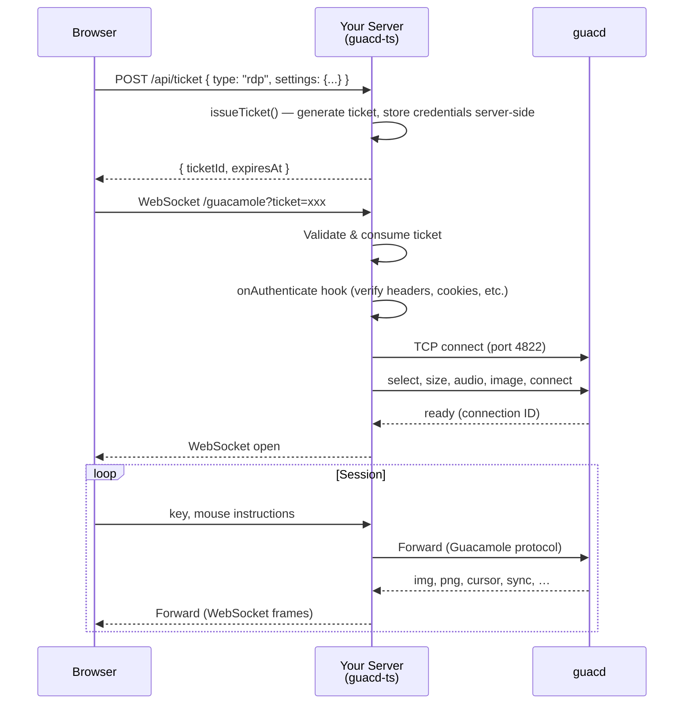

# guacd-ts

[](https://opensource.org/licenses/Apache-2.0)
[](https://www.typescriptlang.org/)
[](https://nodejs.org/)

TypeScript library for bridging WebSocket connections to Apache Guacamole's guacd daemon.

Supports RDP, VNC, SSH, and Telnet. Works with Express, Fastify, or any Node.js HTTP server.

## Table of Contents

- [Features](#features)
- [Connection Flow](#connection-flow)
- [Install](#install)
- [Quick Start](#quick-start)
- [Protocol Builders](#protocol-builders)
- [Tickets](#tickets)
- [Hooks](#hooks)
- [Connection Management](#connection-management)
- [Join Session](#join-session)
- [Custom TicketStore](#custom-ticketstore)
- [Logging](#logging)
- [API Reference](#api-reference)
- [Examples](#examples)
- [Development](#development)
- [License](#license)

## Features

- **Ticket-based auth** — Connection credentials stay server-side. Clients receive a one-time-use ticket.
- **Lifecycle hooks** — Authenticate, intercept, and react to connection events at every stage.
- **Connection management** — List, inspect, and force-disconnect active sessions in real time.
- **Statistics** — Track bytes transferred, session duration, and custom metadata per connection.
- **Pluggable storage** — Built-in in-memory store, or bring your own (Redis, database, etc.).
- **Protocol builders** — Fluent, validated API for RDP, VNC, SSH, and Telnet settings.

## Connection Flow

Your API server calls `issueTicket()` to generate a one-time ticket — guacd-ts manages the ticket internally (in-memory by default, or a custom store like Redis). The browser client ([guacamole-common-js](https://www.npmjs.com/package/guacamole-common-js)) opens a WebSocket connection with the ticket ID as a query parameter. guacd-ts validates and consumes the ticket, then establishes a bidirectional bridge between the WebSocket and guacd.



## Install

```bash
npm install guacd-ts
```

## Quick Start

Initialize with your guacd connection info, attach to any Node.js HTTP server, and issue a ticket — the client connects via WebSocket with that ticket ID. When the HTTP server stops, all connections and internal resources are cleaned up automatically.

```typescript
import http from 'http';
import { GuacamoleServer, createConnectionBuilder } from 'guacd-ts';

const httpServer = http.createServer();
const guac = new GuacamoleServer({
  guacd: { host: '127.0.0.1', port: 4822 },
});

guac.attach(httpServer, '/guacamole');

const { settings } = createConnectionBuilder('rdp')
  .setHostname('192.168.1.100')
  .setCredentials('Administrator', 'password')
  .ignoreCert()
  .build();

const { ticketId } = await guac.issueTicket(settings);

// Client connects with: ws://localhost:3000/guacamole?ticket=<ticketId>
httpServer.listen(3000);
```

### With Express

```typescript
import express from 'express';
import { createServer } from 'http';
import { GuacamoleServer } from 'guacd-ts';

const app = express();
const httpServer = createServer(app);
const guac = new GuacamoleServer({ guacd: { host: '127.0.0.1', port: 4822 } });

guac.attach(httpServer, '/guacamole');

app.post('/api/ticket', async (req, res) => {
  const { ticketId, expiresAt } = await guac.issueTicket(req.body);
  res.json({ ticketId, expiresAt });
});

httpServer.listen(3000);
```

### With Fastify

```typescript
import Fastify from 'fastify';
import { GuacamoleServer } from 'guacd-ts';

const fastify = Fastify();
const guac = new GuacamoleServer({ guacd: { host: '127.0.0.1', port: 4822 } });

guac.attach(fastify.server, '/guacamole');
await fastify.listen({ port: 3000 });
```

## Protocol Builders

Type-safe, validated builders for each protocol. All parameters have autocomplete. See the [Guacamole manual](https://guacamole.apache.org/doc/gug/configuring-guacamole.html) for the full parameter reference.

```typescript
import { createConnectionBuilder } from 'guacd-ts';

// RDP
const rdp = createConnectionBuilder('rdp')
  .setHostname('192.168.1.100')
  .setCredentials('Administrator', 'password')
  .setDisplay(1920, 1080, 96)
  .ignoreCert()
  .enableDrive('shared', '/data')
  .build();

// VNC
const vnc = createConnectionBuilder('vnc')
  .setHostname('192.168.1.100')
  .setPassword('secret')
  .build();

// SSH
const ssh = createConnectionBuilder('ssh')
  .setHostname('192.168.1.100')
  .setCredentials('root', 'password')
  .build();

// Telnet
const telnet = createConnectionBuilder('telnet').setHostname('192.168.1.100').build();

await guac.issueTicket(rdp.settings);
```

## Tickets

Credentials never reach the browser. Your server issues a one-time ticket containing the connection settings, and the client only receives the ticket ID. The ticket is consumed on first use and cannot be reused. The browser client ([guacamole-common-js](https://www.npmjs.com/package/guacamole-common-js)) connects via WebSocket with `?ticket=<ticketId>` (also accepts `?ticket_id=` or `?token=`).

```typescript
// Build protocol settings for the ticket
const { settings } = createConnectionBuilder('rdp')
  .setHostname('192.168.1.100')
  .setCredentials('admin', 'pass')
  .ignoreCert()
  .build();

// Issue a ticket
const { ticketId, expiresAt } = await guac.issueTicket(settings, {
  ticketTtlMs: 10 * 60 * 1000, // Ticket validity (default: 5 min)
  connectionTtlMs: 60 * 60 * 1000, // Max session duration
  guacdOptions: { host: 'guacd-us-east.example.com', port: 4822 }, // Per-ticket guacd routing
  metadata: { userId: 'user-123', displayName: 'John' }, // Arbitrary metadata
});
```

You can revoke an unused ticket before the client connects:

```typescript
await guac.revokeTicket(ticketId);
```

## Hooks

All hooks are optional and can be async. They let you authenticate, intercept, and react to connection lifecycle events.

| Hook              | Trigger                 | Arguments               | Behavior                        |
| ----------------- | ----------------------- | ----------------------- | ------------------------------- |
| `onAuthenticate`  | After ticket validation | `context`               | Return `false` to reject (4403) |
| `onBeforeConnect` | Before guacd connection | `context`               | Throw to reject                 |
| `onConnect`       | Tunnel established      | `connection`            | —                               |
| `onDisconnect`    | Connection closed       | `connection`, `reason?` | —                               |
| `onError`         | Error on connection     | `connection`, `error`   | —                               |

`context` contains `ticketId`, `request` (headers, cookies, IP), `connectionSettings`, `query`, and `metadata`. Tickets don't enforce ownership by themselves — use `onAuthenticate` to verify that the connecting user matches the ticket:

```typescript
// Register hooks via the constructor
const guac = new GuacamoleServer({
  guacd: { host: '127.0.0.1', port: 4822 },
  hooks: {
    onAuthenticate: async (context) => {
      const token = context.request.headers['authorization'];
      const user = await validateToken(token);
      return user?.id === context.metadata?.userId;
    },
    onConnect: (connection) => {
      console.log(`Session started: ${connection.connectionId}`);
    },
    onDisconnect: (connection, reason) => {
      console.log(`Session ended: ${connection.connectionId}`, reason);
    },
  },
});
```

`GuacamoleServer` also extends `EventEmitter`, so you can use `guac.on('open' | 'close' | 'error', ...)` if you need multiple listeners or dynamic registration.

## Connection Management

Inspect and control active sessions at runtime.

```typescript
// List all active connections
const connections = guac.getConnectionList();

// Get a specific connection by ID
const conn = guac.getConnection(connectionId);
console.log(conn?.metadata); // { userId: 'user-123', displayName: 'John' }

// Force-disconnect a session
guac.disconnectConnection(connectionId, 'Admin requested');
```

Per-connection statistics are available via `getStats()`:

```typescript
const stats = conn?.getStats();
// { connectionId, ticketId, metadata, connectedAt, durationMs, bytesReceived, bytesSent, lastActivityAt }
```

Hooks receive the full connection object, so you can also close connections from within:

```typescript
onConnect: (connection) => {
  if (shouldReject(connection.metadata)) {
    connection.close();
  }
},
```

## Join Session

Multiple users can share the same remote desktop session. Session sharing is **disabled by default** — enable it server-wide with `allowJoin: true`, or per-session via `ConnectionSettings.allowJoin`.

```typescript
// Enable sharing for a specific session at ticket issuance
const { ticketId: hostTicket } = await guac.issueTicket({
  type: 'rdp',
  allowJoin: true, // This session can be joined
  settings: { hostname: '192.168.1.100', username: 'admin', password: 'pass' },
});

// After the host connects, issue a join ticket by connection ID
const conn = guac.getConnectionList()[0];
const { ticketId } = await guac.joinSession(conn.connectionId);
```

`joinSession` validates that the connection exists, is ready, and allows joining — then returns a one-time ticket. The per-session `allowJoin` takes precedence over the server default. If neither is set, sharing is denied.

## Custom TicketStore

Tickets are stored in memory by default. For production use with multiple servers or persistence across restarts, implement the `TicketStore` interface with your own backend (Redis, database, etc.).

| Method                | Description                               |
| --------------------- | ----------------------------------------- |
| `get(ticketId)`       | Retrieve a ticket, or `null` if not found |
| `set(ticketId, data)` | Store a ticket                            |
| `delete(ticketId)`    | Remove a ticket                           |

All methods can return a `Promise` for async backends.

```typescript
import type { TicketStore, TicketData } from 'guacd-ts';

// Example: Redis-backed ticket store
class RedisTicketStore implements TicketStore {
  constructor(private client: ReturnType<typeof createClient>) {}

  async get(ticketId: string): Promise<TicketData | null> {
    const data = await this.client.get(`ticket:${ticketId}`);
    return data ? JSON.parse(data) : null;
  }

  async set(ticketId: string, data: TicketData): Promise<void> {
    await this.client.setEx(`ticket:${ticketId}`, 86400, JSON.stringify(data));
  }

  async delete(ticketId: string): Promise<void> {
    await this.client.del(`ticket:${ticketId}`);
  }
}

// Pass to the constructor
const guac = new GuacamoleServer({
  guacd: { host: '127.0.0.1', port: 4822 },
  ticketStore: new RedisTicketStore(redisClient),
});
```

## Logging

By default, guacd-ts produces **no log output**. To enable logging, pass a `logger` option to the constructor.

### Built-in logger

Use `createDefaultLogger()` for quick setup:

```typescript
import { GuacamoleServer, createDefaultLogger } from 'guacd-ts';

const guac = new GuacamoleServer({
  guacd: { host: '127.0.0.1', port: 4822 },
  logger: createDefaultLogger({ level: 'DEBUG' }),
});
```

### Custom logger

Any object that implements the `ILogger` interface works. Wrap your preferred logging library:

```typescript
import pino from 'pino';
import type { ILogger } from 'guacd-ts';

const p = pino();
const logger: ILogger = {
  error: (msg, ctx) => p.error(ctx ?? {}, msg),
  warn:  (msg, ctx) => p.warn(ctx ?? {}, msg),
  info:  (msg, ctx) => p.info(ctx ?? {}, msg),
  debug: (msg, ctx) => p.debug(ctx ?? {}, msg),
  verbose: (msg, ctx) => p.trace(ctx ?? {}, msg),
};

const guac = new GuacamoleServer({
  guacd: { host: '127.0.0.1', port: 4822 },
  logger,
});
```

### Log levels

| Level     | Value | Usage                          |
| --------- | ----- | ------------------------------ |
| `ERROR`   | 0     | Fatal / unrecoverable failures |
| `WARN`    | 1     | Recoverable problems           |
| `INFO`    | 2     | Operational milestones         |
| `DEBUG`   | 3     | Troubleshooting detail         |
| `VERBOSE` | 4     | Wire-level / high-frequency    |

## API Reference

`GuacamoleServer` extends `EventEmitter`. Create an instance, attach it to an HTTP server, and use the methods below to manage tickets and connections.

### Methods

| Method                 | Signature                                          | Description                                                         |
| ---------------------- | -------------------------------------------------- | ------------------------------------------------------------------- |
| `issueTicket`          | `(settings, options?) → Promise<IssuedTicket>`     | Issue a one-time connection ticket                                  |
| `revokeTicket`         | `(ticketId) → Promise<void>`                       | Revoke an unused ticket                                             |
| `attach`               | `(httpServer, path?) → void`                       | Listen for WebSocket upgrades; auto-cleans up when the server stops |
| `handleUpgrade`        | `(request, socket, head) → void`                   | Manually handle an HTTP upgrade request                             |
| `getActiveConnections` | `() → number`                                      | Number of active tunnels                                            |
| `getConnection`        | `(connectionId) → ClientConnection \| undefined`   | Look up a connection by ID                                          |
| `getConnectionList`    | `() → ClientConnection[]`                          | List all active connections                                         |
| `joinSession`          | `(connectionId, options?) → Promise<IssuedTicket>` | Issue a ticket to join an existing session                          |
| `disconnectConnection` | `(connectionId, reason?) → boolean`                | Force-disconnect a session                                          |
| `checkGuacd`           | `(timeoutMs?) → Promise<{ok, latencyMs, error?}>`  | Check whether guacd is reachable (for health endpoints)             |
| `close`                | `() → Promise<void>`                               | Shut down all tunnels and the WebSocket server                      |

### Constructor Options

```typescript
new GuacamoleServer({
  guacd: { host: '127.0.0.1', port: 4822 },
  hooks: {/* see Hooks section */},
  logger: createDefaultLogger({ level: 'INFO' }), // Default: no logging (see Logging section)
  connectionDefaultSettings: {
    rdp: { port: 3389, width: 1920, height: 1080 },
    vnc: { port: 5900 },
    ssh: { port: 22 },
    telnet: { port: 23 },
  },
  ticketStore: redisTicketStore, // Default: in-memory Map
  defaultTicketTtlMs: 300_000, // Default: 5 min
  defaultConnectionTtlMs: 0, // 0 = unlimited
  maxInactivityTime: 0, // WebSocket inactivity timeout (0 = disabled)
  guacdInactivityTimeoutMs: 0, // guacd TCP inactivity timeout (0 = disabled)
  maxConnections: 0, // Server-wide connection limit (0 = unlimited)
  maxJoinedPerSession: 5, // Max users per shared session (including original)
  allowJoin: false, // Whether sessions are joinable by default
});
```

## Examples

See [examples/](./examples) for working setups:

- [Server (Express)](./examples/server/) - REST API with ticket management
- [Client (React)](./examples/client/) - Browser UI

## Development

```bash
npm test              # Run tests
npm run test:coverage # Coverage report
npm run build         # Build
npm run lint          # Lint
npm run format        # Format
```

## License

Apache License 2.0 - See [LICENSE](./LICENSE).

Inspired by [guacamole-lite](https://github.com/vadimpronin/guacamole-lite).
